# Anonymous Supplementary Material

## Updated Figures

  

  <b>(a)</b> Task overview: baseline limitations (left), Zone-Graph Reasoning & Arrangement (middle), multi-dimensional quality comparison (right).

<table><tr>
<td width="78%">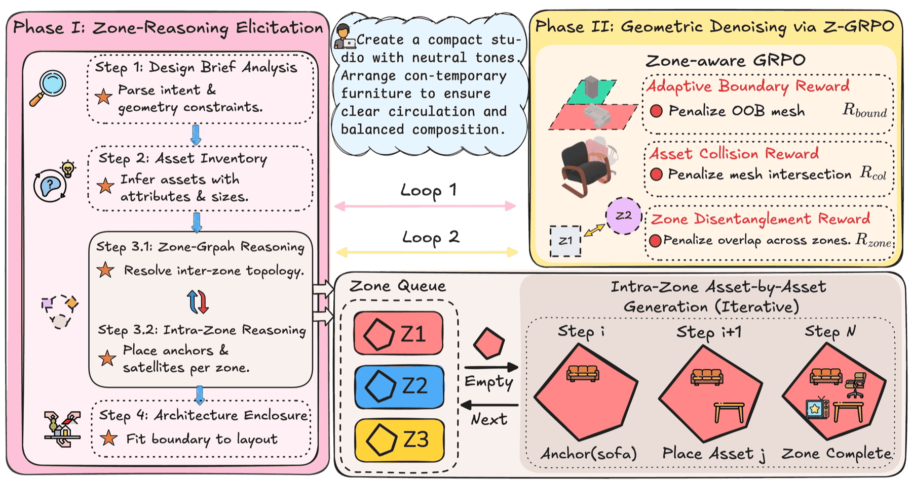</td>
<td width="22%">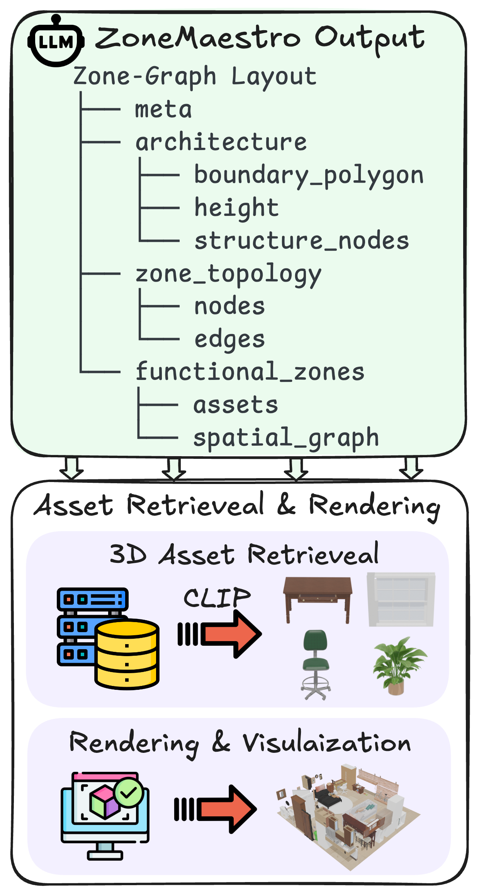</td>
</tr></table>

  <b>(b)</b> Training & generation pipeline: Phase I elicits zone reasoning in five steps; Phase II refines via Z-GRPO with three geometry rewards; two alternating cycles (Loop 1–2) balance diversity and compliance.

  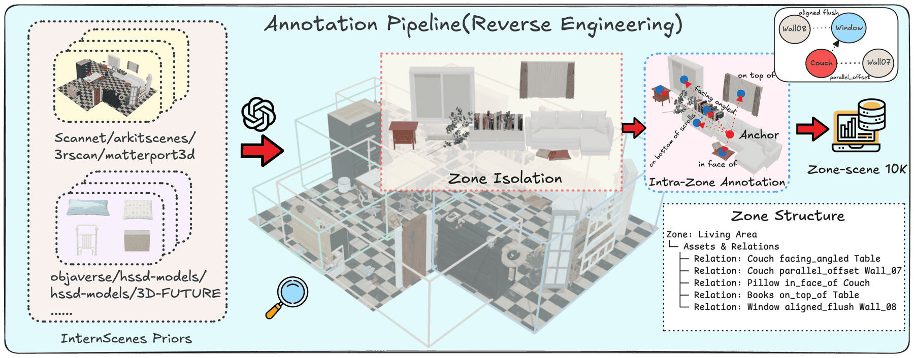

  <b>(c)</b> Zone-Scene-10K construction: reverse-engineering 3D scans into zone-isolated spatial graphs with typed anchor–satellite edges.

**Figure A: Updated Figure 1 & Figure 2 with improved readability.** We split the original Figure 2 into (b) and (c) to reduce information density. Detailed descriptions remain in the main paper Sections 3.1–3.3.

---

## Additional Experiments

**Table 1: Human Evaluation Study (20 test cases × 30 evaluators, Fleiss' κ = 0.63).** Three instruction-following dimensions: Zone Assignment (objects in correct functional zones), Relative Placement (spatial relationships match instruction), and Object Combination (specified object groups present). All methods anonymized and randomized.

| Method | Zone Assignment (%) | Relative Placement (%) | Object Combination (%) | Average (%) |
|:---|:---:|:---:|:---:|:---:|
| DiffuScene | 35.8 | 41.3 | 53.2 | 43.4 |
| ReSpace | 49.5 | 55.2 | 64.8 | 56.5 |
| LayoutGPT | 22.4 | 37.5 | 72.1 | 44.0 |
| LayoutVLM | 54.6 | 60.8 | 78.4 | 64.6 |
| Holodeck | 61.2 | 65.4 | 82.6 | 69.7 |
| i-Design | 39.8 | 46.5 | 63.7 | 50.0 |
| **ZoneMaestro** | **88.5** | **84.2** | **92.3** | **88.3** |

  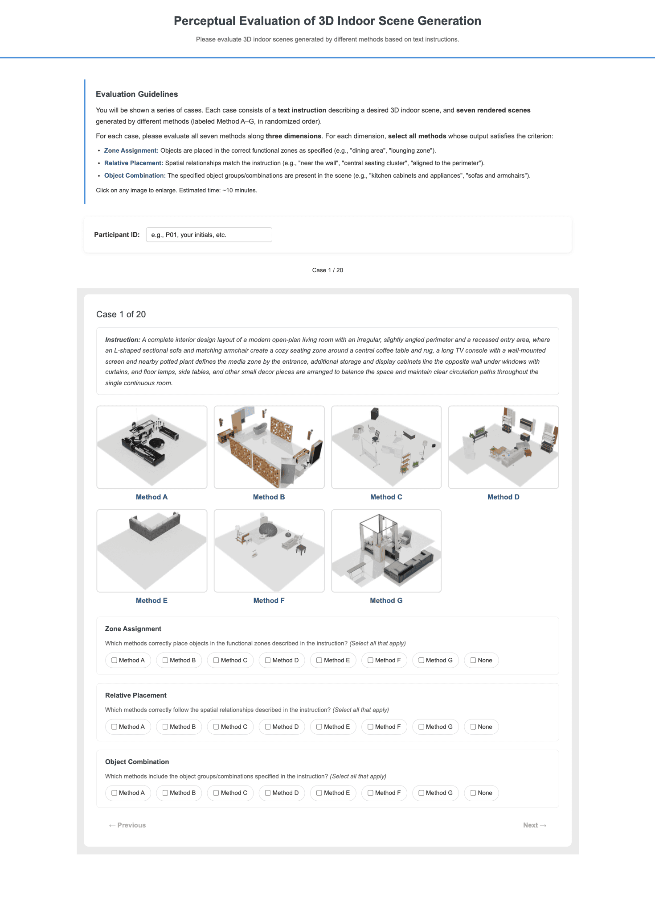

**Figure B: User study screenshot.** Interface used for human evaluation in Table 1.

---

**Table 2: Scene Usability Metrics on SCALE.** Following SceneEval (Tam et al., 2025), computed from 2D occupancy grids at 0.05 m resolution. **NAV**: navigability (largest connected free-floor / total free space). **ACC**: functional-side clearance ratio. **WFR**: walkable floor ratio. **MCW**: minimum corridor width. **REACH**: collision-free path connectivity. **E-NAV** = NAV × max(0, 1 − OOB), where OOB is from Table 1 of the main paper; methods with OOB ≥ 1 receive E-NAV = 0.

| Method | NAV↑ | WFR↑ | ACC↑ | MCW(m)↑ | REACH | E-NAV↑ |
|:---|:---:|:---:|:---:|:---:|:---:|:---:|
| DiffuScene | 0.938 | 0.640 | 0.305 | 0.204 | 1.000 | 0.732 |
| ReSpace | 0.980 | 0.856 | 0.562 | 0.230 | 1.000 | 0.598 |
| LayoutGPT | 0.988 | 0.892 | 0.265 | 0.236 | 1.000 | 0.000 |
| LayoutVLM | 0.997 | 0.856 | 0.548 | 0.213 | 1.000 | 0.728 |
| Holodeck | 1.000 | 0.832 | 0.499 | 0.215 | 1.000 | 0.260 |
| i-Design | 0.958 | 0.755 | 0.312 | 0.199 | 1.000 | 0.000 |
| **ZoneMaestro** | 0.973 | 0.720 | 0.429 | 0.207 | 1.000 | **0.885** |

---

**Table 3: Z-GRPO Leave-one-out Reward Ablation.** Each variant removes one reward under the full Alternating Spatial Alignment setup. Weights: λ\_bound = 1.0, λ\_zone = 0.5, λ\_col = 2.0; KL coefficient β = 0.04.

| Variant | OOB↓ | Col↓ | Aes↑ | Real↑ | Str↑ | Geo↑ | Sem↑ | Func↑ | Avg↑ |
|:---|:---:|:---:|:---:|:---:|:---:|:---:|:---:|:---:|:---:|
| Full | **0.09** | **0.04** | 7.88 | **4.95** | **5.19** | 8.22 | **7.82** | **7.69** | **6.96** |
| w/o R\_bound | 0.15 | 0.05 | 7.85 | 4.78 | 5.06 | 7.98 | 7.76 | 7.59 | 6.84 |
| w/o R\_zone | 0.11 | 0.06 | **7.90** | 4.88 | 5.15 | **8.18** | 7.74 | 7.63 | 6.91 |
| w/o R\_col | 0.10 | 0.11 | 7.84 | 4.73 | 5.13 | 8.20 | 7.80 | 7.58 | 6.88 |

---

**Table 4: Controlled Data Comparison — ReSpace retrained on Zone-Scene-10K (original SFT+GRPO recipe).**

| Variant | OOB↓ | Col↓ | Cnt | Aes↑ | Real↑ | Str↑ | Geo↑ | Sem↑ | Func↑ | Avg↑ |
|:---|:---:|:---:|:---:|:---:|:---:|:---:|:---:|:---:|:---:|:---:|
| ReSpace (orig.) | 0.39 | 0.66 | 9.48 | 7.34 | 4.22 | 4.68 | 6.79 | 5.78 | 6.06 | 5.81 |
| ReSpace (Zone-Scene-10K) | 0.24 | 0.25 | 9.07 | 7.48 | 4.52 | 4.90 | 7.15 | 6.12 | 6.35 | 6.09 |
| **ZoneMaestro** | **0.09** | **0.04** | **23.35** | **7.88** | **4.95** | **5.19** | **8.22** | **7.82** | **7.69** | **6.96** |

---

**Table 5: 50-Case Instruction-Following Evaluation.** Physical metrics and GPT-4o-mini scores (1–10 scale) on a curated subset emphasizing diverse instruction types.

| Method | OOB↓ | Col↓ | Cnt↑ | Aes↑ | Real↑ | Str↑ | Geo↑ | Sem↑ | Func↑ | Avg↑ |
|:---|:---:|:---:|:---:|:---:|:---:|:---:|:---:|:---:|:---:|:---:|
| DiffuScene | 0.29 | 0.61 | 8.94 | 6.62 | 2.85 | 2.68 | 5.82 | 3.82 | 4.58 | 4.39 |
| ReSpace | 0.52 | 0.73 | 8.31 | 6.55 | 3.75 | 4.45 | 6.28 | 5.22 | 5.45 | 5.28 |
| LayoutGPT | 8.05 | 0.64 | 13.82 | 4.88 | 2.32 | 2.95 | 4.40 | 3.82 | 3.52 | 3.65 |
| LayoutVLM | 0.20 | 0.10 | 21.87 | 5.58 | 3.15 | 3.38 | 5.48 | 4.28 | 4.50 | 4.40 |
| Holodeck | 0.58 | 0.05 | 19.21 | 4.08 | 3.12 | 3.65 | 4.65 | 3.45 | 3.28 | 3.71 |
| i-Design | 2.58 | 5.12 | 14.03 | 4.52 | 2.32 | 2.55 | 4.88 | 4.52 | 4.25 | 3.84 |
| **ZoneMaestro** | **0.11** | **0.05** | **23.91** | **7.00** | **4.27** | **6.11** | **7.62** | **7.38** | **7.03** | **6.57** |

---

## Qualitative Examples

  
<i><b>Instruction (Case 1):</b> Plan the overall layout so that larger pieces like sofa, dining table, tv stand, and sideboard are kept close to the walls or room centerlines, while smaller items such as side table, plant, and floor lamp fill in secondary positions. Maintain consistent spacing between furniture groups. Ensure each zone feels distinct yet visually connected.</i>

<table><tr>
<td width="49%">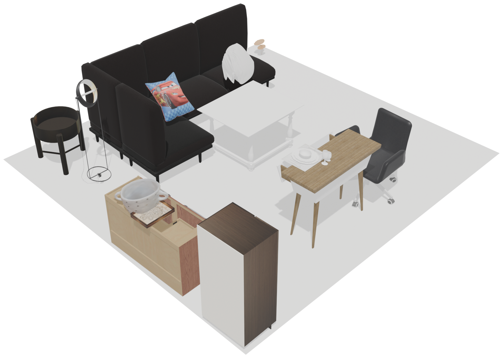</td>
<td width="49%">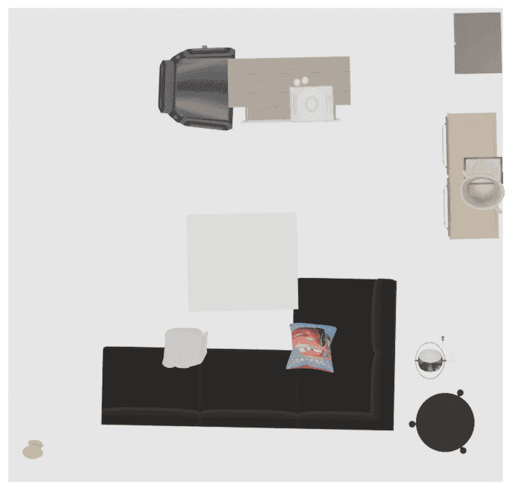</td>
</tr></table>

  
<i><b>Instruction (Case 2):</b> Hoping to create a conversation-friendly living area where the sofa, armchair, and ottoman all loosely face the coffee table while still opening toward the dining zone. The sofa should hug the corner of the room, with a potted plant at one end and a side table at the other. A small storage cabinet can sit behind the armchair, helping to define the edge between living and circulation space.</i>

<table><tr>
<td width="49%">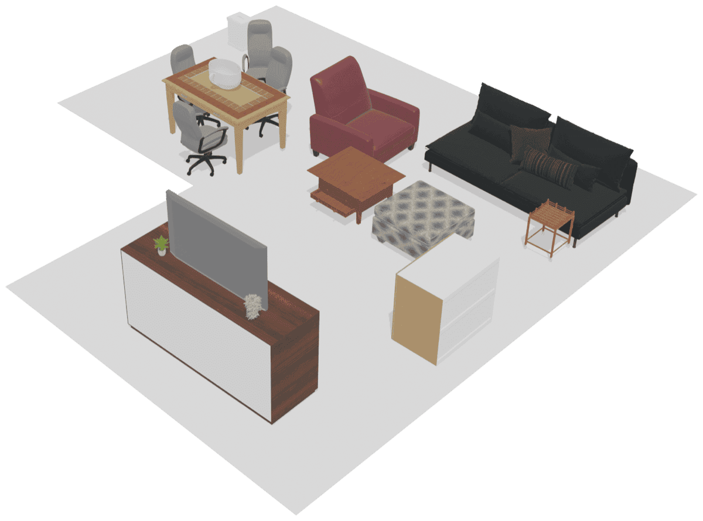</td>
<td width="49%">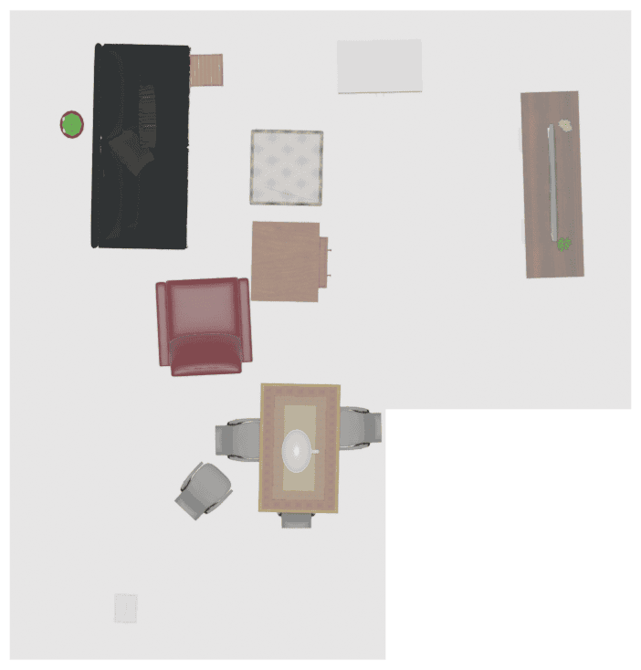</td>
</tr></table>

  
<i><b>Instruction (Case 3):</b> Open-concept family living room emphasizing clear sightlines from the dining table across to the sofa and TV wall. Arrange all main furniture parallel to the room's long walls, avoiding diagonal placements that would disrupt the flow. Use the central open area around the pouf as flexible space for kids to play or guests to mingle.</i>

<table><tr>
<td width="49%">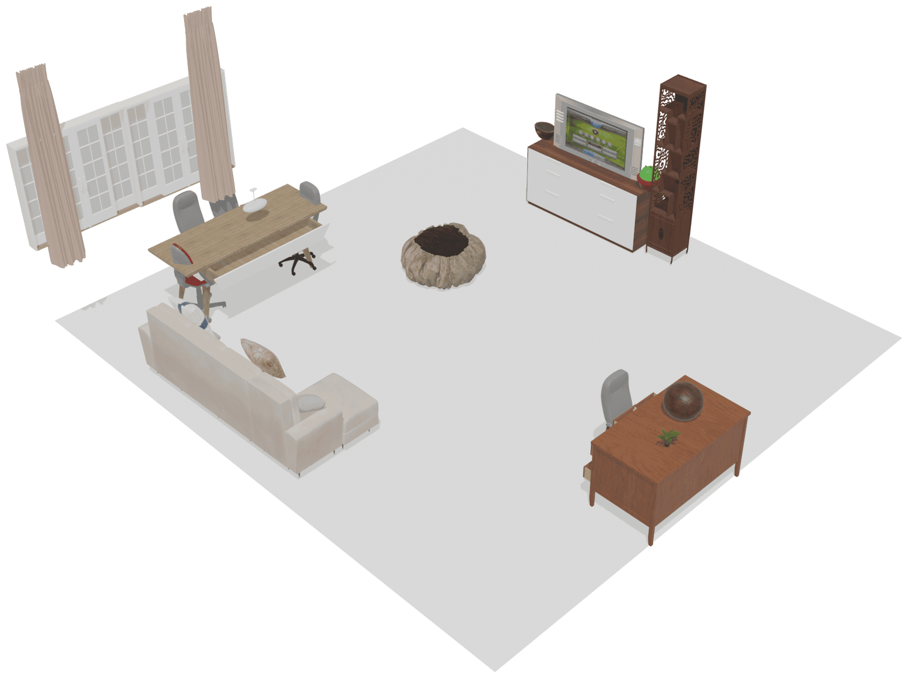</td>
<td width="49%">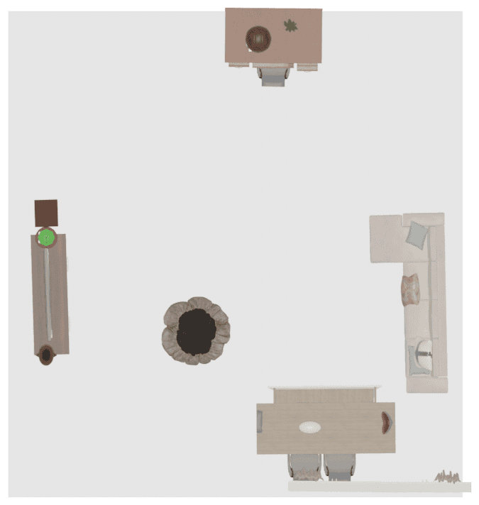</td>
</tr></table>

  
<i><b>Instruction (Case 4):</b> For this particular irregular footprint, plan a single open-plan office where the central rectangular core is a large workstation zone with a main executive desk, office chair, side drawers and desktop computer, the upper side forms a linear storage and plant display strip, the lower side holds a lounge/meeting area with sofa, coffee table and side chairs, the left recess is arranged as an informal breakout and reading corner with round table, shelving and potted plants, and the right recess is organized as a focused work and filing area with additional desks, cabinets and bookshelves, all laid out without internal walls.</i>

<table><tr>
<td width="49%">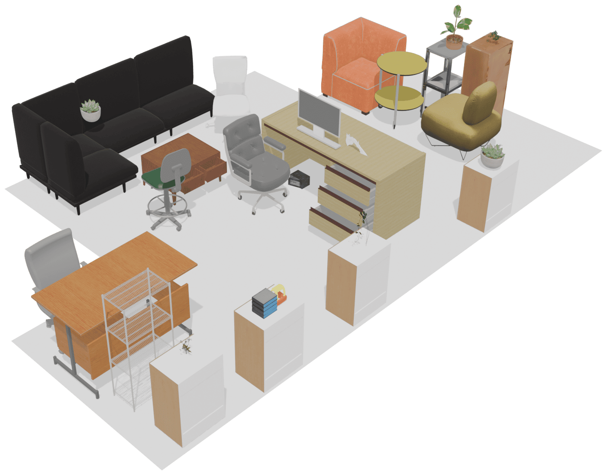</td>
<td width="49%">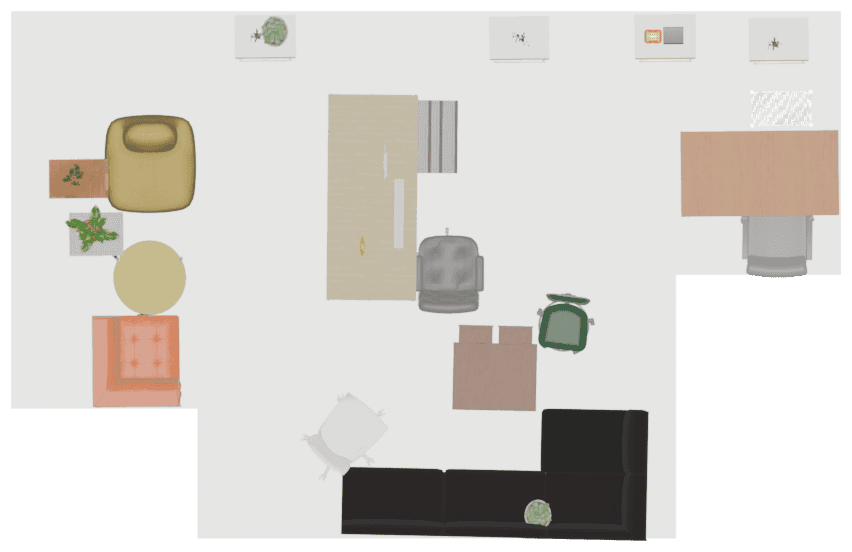</td>
</tr></table>

  
<i><b>Instruction (Case 5):</b> Versatile study room featuring a central collaboration area and a dedicated teaching wall with a full-size writing surface.</i>

<table><tr>
<td width="49%">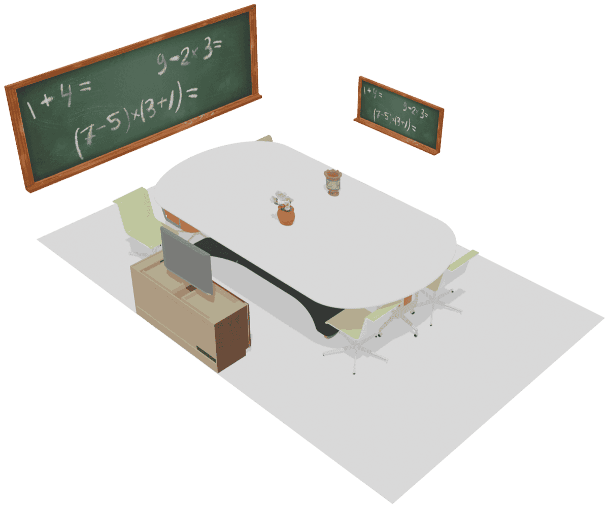</td>
<td width="49%">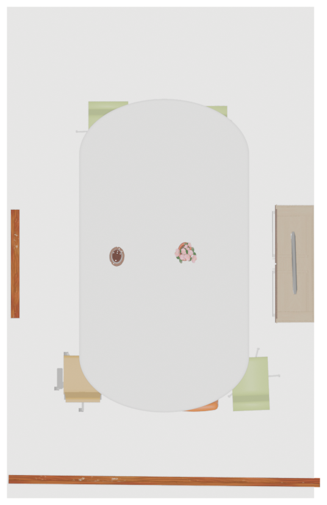</td>
</tr></table>

**Figure 1: Qualitative examples on diverse room types.** Each case shows the instruction alongside diagonal and top-down views.

---

  
<i><b>Instruction (Case 6):</b> A bright open-plan room in an irregular layout with two long windowed walls, centered on a wooden dining table on a rug, a window-side reading nook, plants and framed art along the walls, a low sideboard under the windows, warm wood floors, light walls, and open circulation.</i>

<table><tr>
<td width="49%">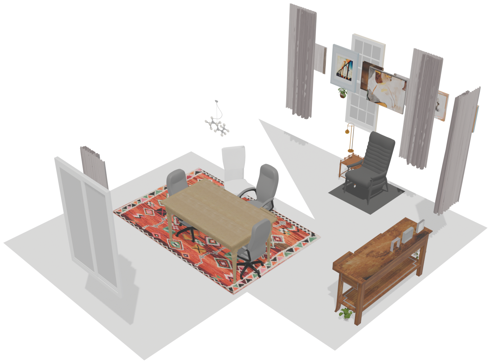</td>
<td width="49%">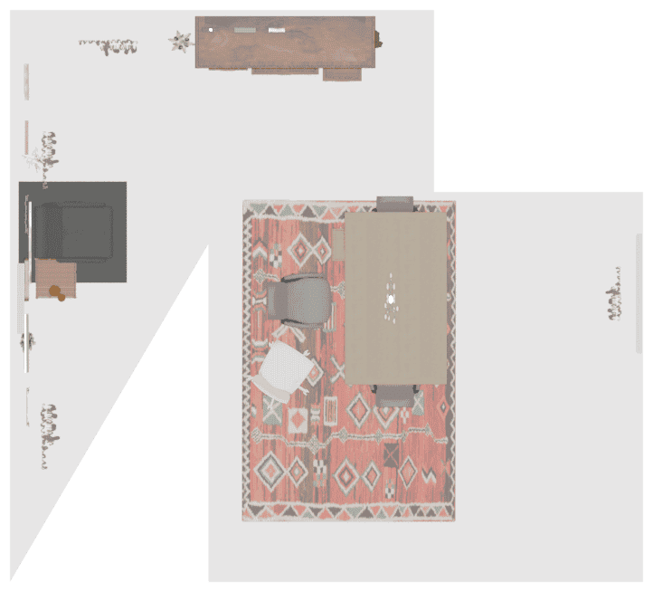</td>
</tr></table>

  
<i><b>Instruction (Case 7):</b> A flat-shaded architectural plan of a single open-plan office where clusters of rectangular desks with rolling chairs, desktop computers, lamps, and scattered potted plants define multiple workstations around the perimeter, additional shared tables occupy the central collaboration zone, storage cabinets and shelving line the walls, and a small lounge corner with a rug, low coffee table, and floor cushions forms a relaxed meeting area.</i>

<table><tr>
<td width="49%">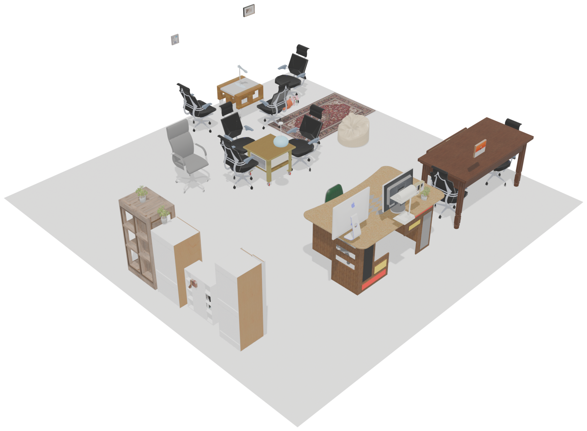</td>
<td width="49%">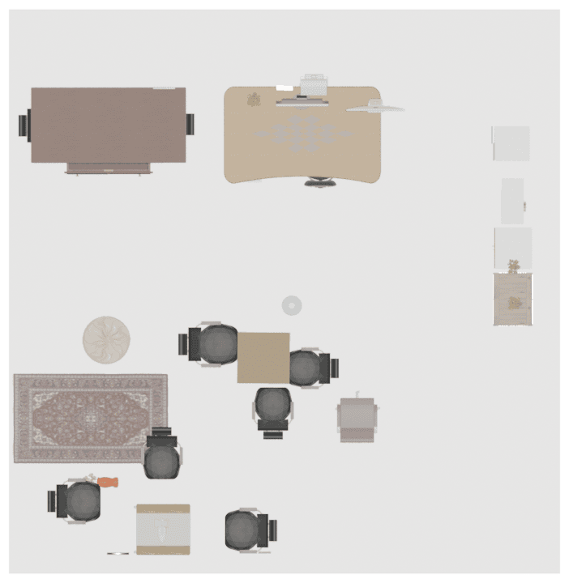</td>
</tr></table>

  
<i><b>Instruction (Case 8):</b> Inside this non-rectangular perimeter, arrange a single open-plan living room that follows the tapered trapezoid shape, with full-height windows along the two long angled walls, dense plant beds and potted greenery lining the outer edges, and in the wider center place two facing sofas with a coffee table and stools on a rug, plus a sideboard and lounge chair tucked toward the narrower end so the furniture layout naturally mirrors the room's angled geometry.</i>

<table><tr>
<td width="49%">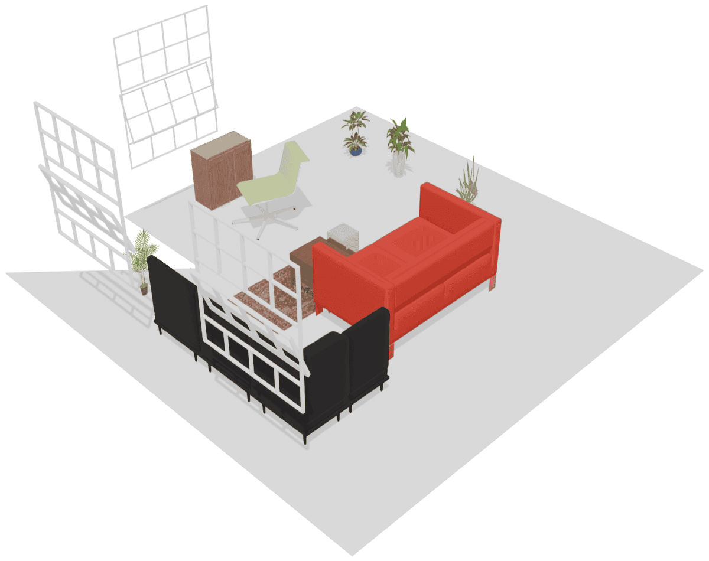</td>
<td width="49%">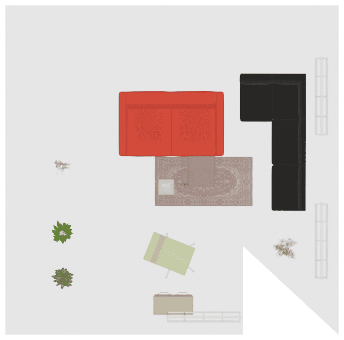</td>
</tr></table>

  
<i><b>Instruction (Case 9):</b> Generate a top-down view of a single large rectangular open-plan dining room with no internal walls, where the perimeter is lined with tall windows on two adjacent sides fitted with curtains and occasional sideboards or low cabinets, and the interior floor is divided into multiple functional dining clusters: several rectangular dining tables with 4–6 chairs each arranged near the edges, a larger central square table with chairs on all sides, a few lounge-style seating nooks in the corners using armchairs and sofas with small side tables, and all furniture (tables, chairs, sideboards, cabinets, and decorative centerpieces) laid out clearly to show circulation paths and varied seating zones within this one continuous space.</i>

<table><tr>
<td width="49%">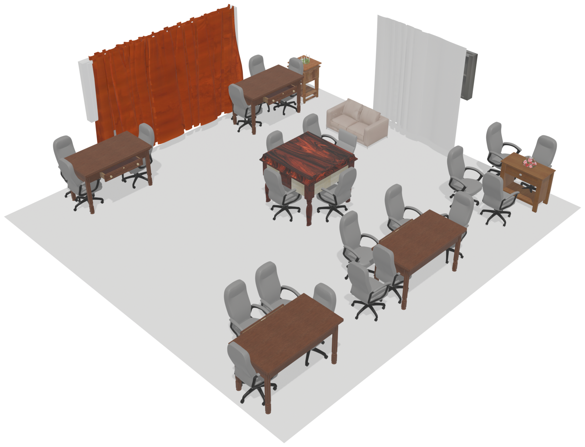</td>
<td width="49%">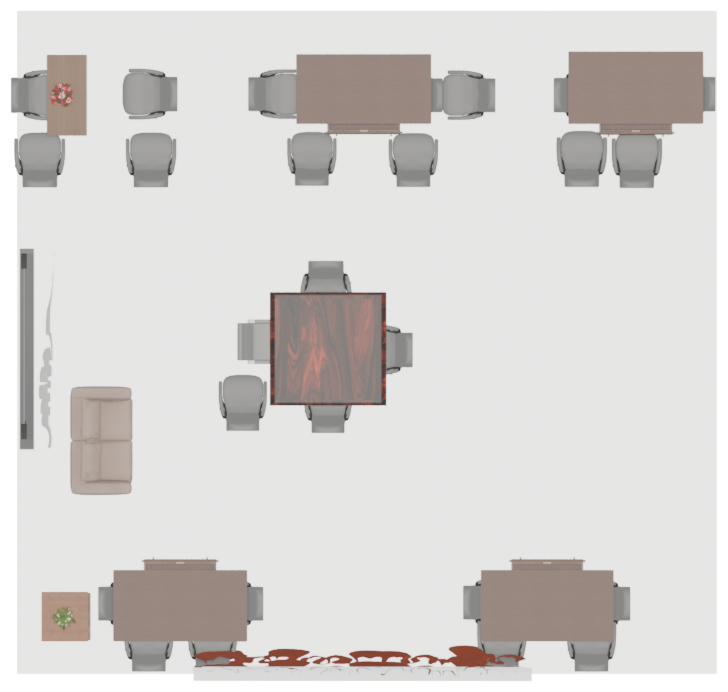</td>
</tr></table>

  
<i><b>Instruction (Case 10):</b> Adapting to the unique wall angles, create a single open-plan study room that follows the slightly skewed rectangular perimeter shown, with long parallel walls and two shorter angled ends, organizing distinct work zones along the windowed walls by placing three separate desk setups (each with rolling chairs, desktop or laptop, lamps, stationery, and books) arranged in an L-shaped workstation configuration, adding wall-mounted shelves and storage cabinets above and beside the desks, positioning a central open floor area with a large rectangular rug for circulation and informal work, using the shorter inner wall segments as partial dividers without closing off the volume, and populating the space with plants, pinboards, and small accessories to match the dense, well-equipped look of the reference layout.</i>

<table><tr>
<td width="49%">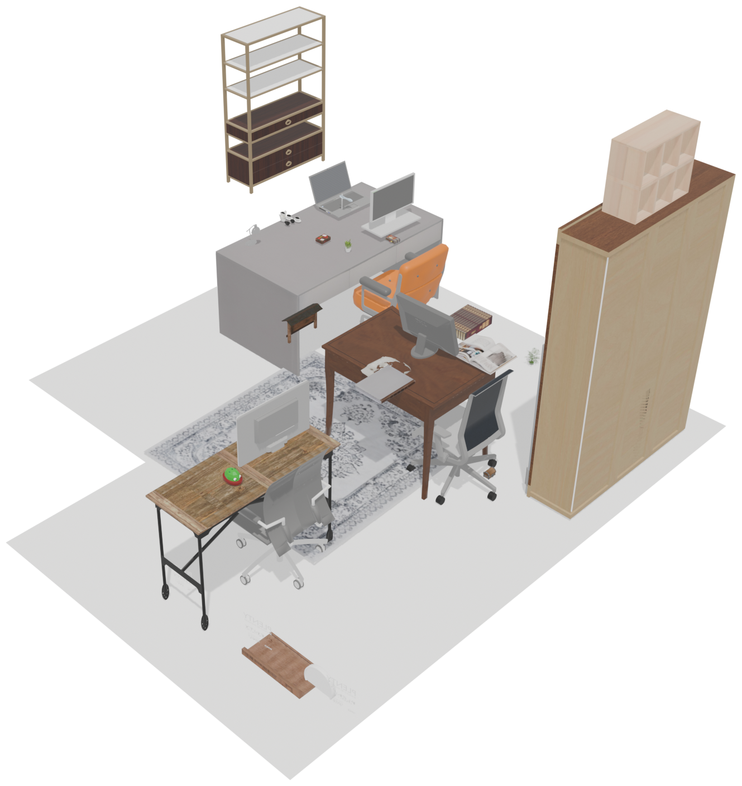</td>
<td width="49%">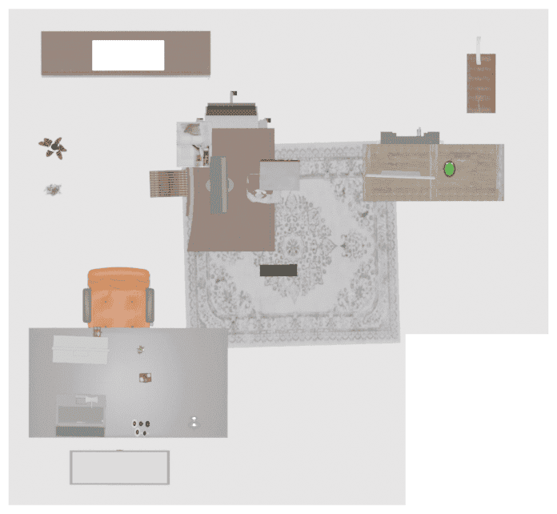</td>
</tr></table>

**Figure 2: Qualitative examples on non-convex architectural boundaries.** Each case shows the instruction alongside diagonal and top-down views.

---

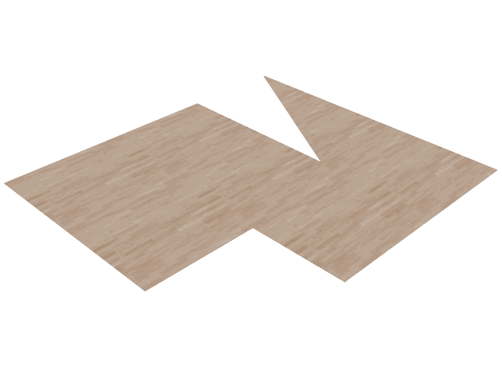

**Figure 3: Progressive generation visualization.** The animation shows ZoneMaestro's four-stage reasoning: zone inventory → intra-zone spatial graphs → global topology → architecture enclosure.